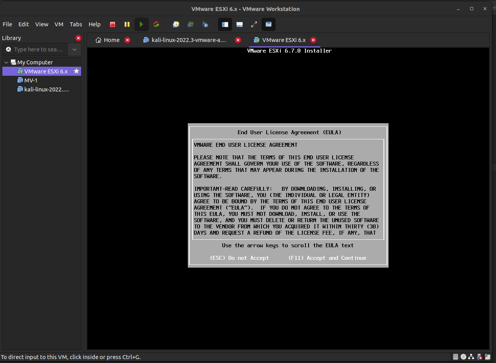
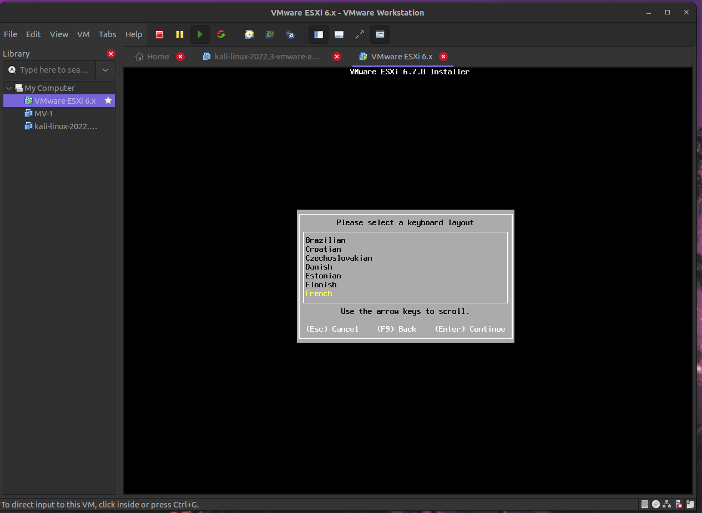
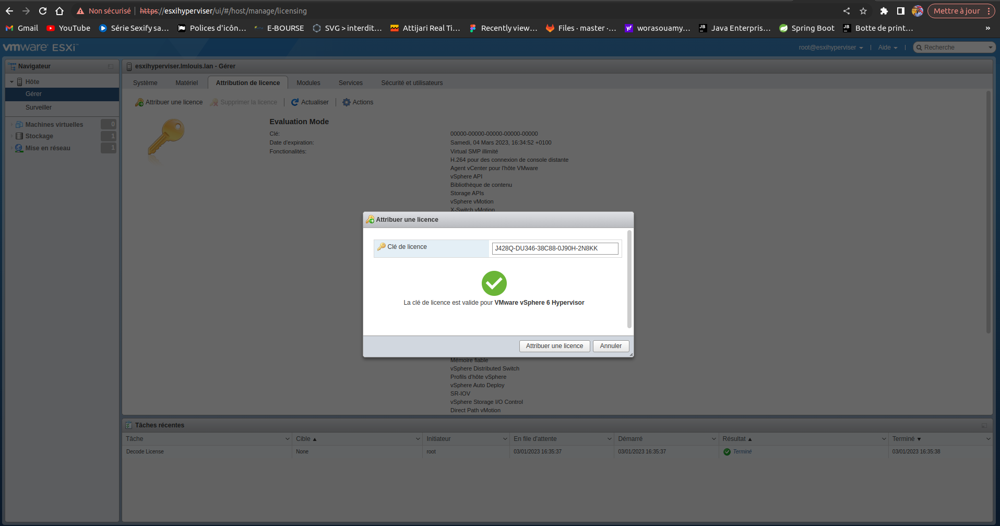

#Installer l’hyperviseur « VMware ESXi » dans votre machine.

Apuyer entrer 

Accepter la licence 

Continuer avec la partition 50 GB

Choisir le français comme langue 

definir son mot de pass root

Confirmer l'installation de ESXI


Editer le virtual network 

host-only adress réseau 192.168.
Redemarer 

Customiser parametres reseaux


changer les paramètres ipv4: 
adressage static
ipv4 primaire : 192.168.102.49 

masque de sous réseau : 255.255.255.0

passerelle par defaut : 192.168.102.0

désactiver l'adressage ipv6


curtomiser nom de domaine esxi


[http://esxihyperviser](http://esxihyperviser.lmlouis.lan)

prefix : lmlouis.lan


Redemarrer en appuyant `echap` puis `Y`

Test connexion réseau réussi 


Ajouter hostame sur ubuntu

`sudo echo "192.168.102.49 esxihyperviser" >> /etc/hosts` 

verifier si le vifier l'enrégistrement a été prise en compte avec 

`sudo cat /etc/hosts | grep "esxihyperviser"`

Entrer dans le client esxi et importer la clé de licence


# Installer le serveur Web apache ou nginx dans la VM-1.


J'ai installer le serveur web en crént un pont entre le groupe VM network et le Network management avec les paramètres suivnts:

adresse : 192.168.102.50

masque de sous réseau : 255.255.255.0

ensuite installer git et recupere le fichier d'installation de docker via git gitthub qui contient ce code :
```
cd $HOME && touch docker-installer.sh && chmod +x docker-installer.sh
cd $HOME && echo '#!/bin/bash' > docker-installer.sh && echo '# -*- ENCODING: UTF-8 -*-' >> docker-installer.sh
echo 'sudo apt update' >> docker-installer.sh
echo 'sudo apt install apt-transport-https ca-certificates curl software-properties-common -y' >> docker-installer.sh 
echo 'curl -fsSL https://download.docker.com/linux/ubuntu/gpg | sudo apt-key add -' >> docker-installer.sh
echo 'sudo apt install docker-ce -y' >> docker-installer.sh
echo 'apt-cache policy docker-ce' >> docker-installer.sh
```
exécuter avec `./docker-installer.sh`


-p 192.168.1.100:8080:80


Personnaliser les paramètres de la machine VM1


